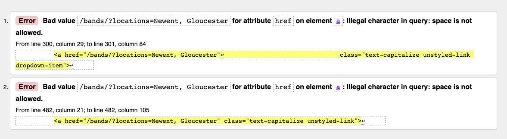
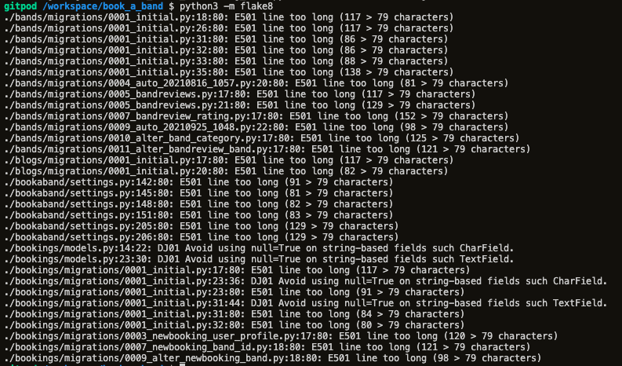

# Testing

### Functionality Testing

-  Manual testing was carried out on:
    - Desktop: Apple and Dell
    - Tablets and mobile: Apple and Samsung
    - Browsers: Chrome, Safari, Edge and Internet Explorer

    Live tests were also carried out on [https://comparium.app/](https://comparium.app/)

During testing the following tests were carried out on large and small screens

- Nav Bar/Footer
    - All nav bar links worked and directed user to correct page. 
    - Collapse navbar worked on smaller screens across all browsers and was accessible through a hamburger icon.
    - Accordians and dropdowns worked on all browsers.
    - My account menu displayed correct options depending on user/superuser status.
    - The search bar worked across the site both from the nav bar and the footer.
    - The nav bar search element appears in collapsable menu for screens. 
    - All social links are opened in separate tabs. 
    - Toasts appear and are clear to the user when actions have been successful. 

- Index Page
    - CTA button directs user to the 'all bands' page. 
    - Category tiles expand when mouse moves over them. They all link to the 'all bands' page and display correct bands by category. 
    - Icons at bottom of page rotate when mouse moves over them. 
    - The links all direct the user to the correct page. 
    - 'My bokings' page only accessible if user logged in.
    - All sections are responsive and are formatted accordingly.

- Musicians Page
    - All page quick links work and filter the results due to what link is chosen. 
    - All buttons take the user to the diesired page. 
    - 'Location' has overflow added to avoid being too long a list. 
    - 'Location' venues also display the correct number of bands in that location. 
    - The cards are fully resposive showing from anywhere between four cards to one card per row depending on screen size. 
    - The search results at the top of the screen tells the user how many bands have been returned by the query. There is also a link to clear the query and display all bands again. 
    - If no image is present for a band, then a generic image appears in it's place.
    - The band cards are paginated to 12 cards per page. This also takes any arguments or queries added by the user and paginates the results successfully across the pages. 

- Band Profile
    - All buttons take the user to desired page.
    - Large image is replaced by smaller image if and when one is selected.
    - Ratings are calculated as an average of from the reviews. If no ratings or reviews, then that is communicated to the user. 
    - Suggested band cards are responsive to the screen size. 
    - If superuser is logged in, they can choose to edit the band information. This takes the superuser to a form which is automatically filled in with the current information in the database. 

- New Bookings Page
    - If the user creates a new booking, the form displayed is clear and responsive. 
    - Form validation is present, allowing the user to only leave address2 and additional information blank. 
    - The wedding date field is only editable via the jQuery datepicker. This also allows the field to be formatted correctly. 
    - The start time field automatically updates any integer in 24hr clock format. 
    - The 'clear form' button clears all fields. 
    - The 'create booking' button saves the form information and adds the information to the booking model. 
    - The image displayed on the page correlates to the band currently being booked. 

- My Bookings Page/Payment
    - Bookings that have been paid for appear as confirmed and likewise, those not paid for appeear as unconfirmed. 
    - Tooltips appear when delete or review icons are hovered over. 
    - The delete icon opens a modal to confirm whether the user wishes to delete this booking. 
    - The review icon leads the user to a review page. 
    - The checkout button takes the user to a checkout page incorporating Stripe functionality. 
    - The payment page also itemises unpaid bookings and displays total which is currently being paid for. 
    - The Stripe payment function (which is in test mode) was tested with both a successful payment card number as well as various card errors which are avaiable in the Stripe docs. 
    - On successful payment, the user is directed back to the booking page where all bookings are now confirmed.

- Blogs 
    - Blogs cards are responsive depending on screen size. 
    - They grow as the user moves their mouse over each card. 
    - The card displays date where the blog was last updated. 
    - All links to social media and the blog source open in new tabs. 
    - Blogs are rendered with line breaks. 

- Add/Edit forms
    - All forms are rendered correctly and are responsive. 
    - All form validation is present and correct.
    - Editing forms display content already present on database. 
    - Ratings form prevents user from going above 5 or below 1 for the rating. 

- Delete functions
    - All delete functions remove objects from database. 

- Security
    - Using the @login_required decorator enforces all users to be logged in to view member pages. If user is not logged in, they are directed to the sign in page. 
    - Similarly, this is the case for all pages that are only available to the superuser. 
    - If users try and direct to a band profile page or blog page that doesn't exist they are directed to the error page. From here, the user may use the navigation bar or the home button to direct back to a safe place. 

### Validation

HTML, CSS and Python code was all tested using online validators. 

#### HTML Validator

The following pages passed validation successfully:
Index, band profile, blog page, read blog, login, my bookings, add review, add band, add blog, edit band, edit blog. 
 
The following error appeared when testing the bands page:

This is due to the variable having a space in it. This has been corrected using javascript and replacing all spaces in links to '%20'

#### CSS Validator

All CSS passed without error

#### Flake8

The following errors appear when running <code>python3 -m flake8</code> in the terminal. 

The errors displayed are all either in automativcally generated files, or deal with <code>null=True</code> being used on string based fields. 

No errors were found when running python code through [PEP8 Online Check](http://pep8online.com/checkresult)

### Testing User Stories

|#|Results|
|---|---|
|US01|The purpose of the website is clear from the index page. The header and subtitle make it clear the site's purpose. The four stages of making a booking at the end of the index page explains the steps clearly. The imagery on the index page further backs the site's function.|
|US02|Across the site, there are many ways the user may navigate to the bands page. Most commonly, this will be done through the nav bar menu. A link is also available in the footer and via various buttons across the pages. |
|US03|The blogs are easy to navigate to via the nav bar menu|
|US04|Users can search for bands using the search bar in the nav bar or the footer. These are visible across all pages|
|US05|Location and price can be filtered using the quick links on the 'all bands' page|
|US06|Viewing a bands profile page will display details, cost, ratings and location to the user|
|US07|Reviews are available to read on the band's profile page|
|US08|Suggestions for similar bands appear on the band's profile page. These are filtered through bands in the similar category and are chosen at random|
|US09|Blogs are available through the blogs page.|
|US10|Blogs can be shared directly to social media via the icons at the end of the blog. The post is made automatically meaning the user just needs to share.|
|US11|Social media links are displayed in the footer across all pages on the site.|
|US12|Contact information is displayed in the footer across all pages on the site.|
|US13|Account registration is accessible through the My Accounts tab in the nav bar as well as as a link on the home page. Users are also navigated directly to sign in and registration if they try and access a page or make a booking without logging in.|
|US14|Bookings can be made via each band's profile page. They can input all necessary information needed to create a booking for the band.|
|US15|All bookings made by the user are available to view on the my bookings page.|
|US16|Once payment has been received, all bookings are automatically confirmed.|
|US17|All confirmed bookings are available on the my bookings page. |
|US18|From the 'my bookings' page, users who have confirmed and paid for a band may then leave a review for that particular band. |
|US19|Bookings that aren't yet paid for or confirmed may be deleted. Before deletion is successful, the user must confirm this via the modal. |
|US20|Account information can be updated and recovered on the log in pages.|
|US21|Bands can be added from the Add Bands tab under My Account. Band information can be updated from their band profile page. |
|US22|Blogs can be added from the Add Blog tab under My Account, alternatively, from the Blogs page. From the Blogs page, the superuser is able to delete and edit the blogs too.|